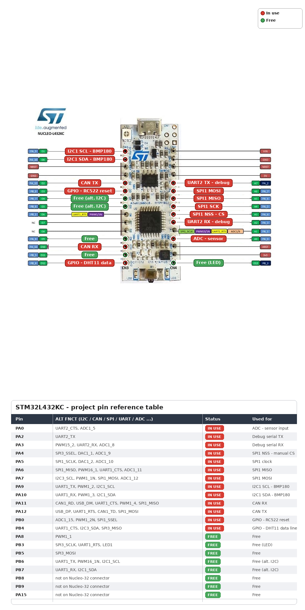

# STM32L432KC - Current project pinout

> This pinout reflects the active configuration used in the project at the time of the current debugging and sensor integration work. It is intentionally practical and hardware-oriented, not a generic board map.

## Active MCU assignments

| Pin | Function | Status |
| --- | --- | --- |
| PA0 | ADC input | Used |
| PA2 | UART2_TX | Used |
| PA3 | UART2_RX | Used |
| PA4 | SPI1_NSS / CS manual | Used |
| PA5 | SPI1_SCK | Used |
| PA6 | SPI1_MISO | Used |
| PA7 | SPI1_MOSI | Used |
| PA9 | I2C1_SCL | Used |
| PA10 | I2C1_SDA | Used |
| PA11 | CAN_RX | Used |
| PA12 | CAN_TX | Used |
| PB0 | RC522 reset / GPIO control | Used |
| PB1 | General GPIO / alternate USART3_RTS_DE | Free |
| PB4 | DHT11 DATA line | Used |
| PB6 | Reserved for I2C alternate usage | Free |
| PB7 | Reserved for I2C alternate usage | Free |
| PB3 | User GPIO / LED-related usage | Free |
| PB5 | General GPIO | Free |
| PB8 | General GPIO | Free |
| PB9 | General GPIO | Free |
| PA8 | PWM TIM1 function | Used |
| PA15 | General GPIO / alternate function | Free |

## Peripheral mapping

| Peripheral | MCU pins | Notes |
| --- | --- | --- |
| ADC | PA0 | ADC input used for project testing |
| I2C1 | PA9, PA10 | BMP180 connected here |
| UART2 | PA2, PA3 | Serial debug / printf |
| SPI1 | PA4, PA5, PA6, PA7 | Used for SPI peripheral work and RC522 experiments |
| DHT11 | PB4 | Data line for DHT11 sensor |
| CAN | PA11, PA12 | CAN RX/TX |

## Sensor-specific wiring currently in use

| Sensor / Module | Pin used | Notes |
| --- | --- | --- |
| BMP180 | PA9 = SCL, PA10 = SDA | I2C1; mounted on the board and working |
| DHT11 | PB4 | Data pin; 1-wire protocol |
| SPI device | PA4-PA7 | SPI1 bus on MCU |
| UART debug | PA2-PA3 | UART2 for serial log |

## Important warnings

- The DHT11 data line is not shared with UART2. PB4 is intentionally selected to avoid PA2/PA3 conflict.
- The project has multiple configurations for I2C and SPI, but the current active mapping is:
  - I2C1 on PA9/PA10
  - SPI1 on PA4/PA5/PA6/PA7
- If a different peripheral is enabled on the same pins, it must be reconfigured before reuse.
- GPIOs such as PB0, PB3, PB4, PB5, PB8, and PB9 are convenient for lab experiments, but they should be assigned intentionally to avoid collisions.

## Recommended board reference

The current practical pin map for this project is:

- BMP180: PA9 / PA10 (I2C1)
- DHT11: PB4
- SPI bus: PA4 / PA5 / PA6 / PA7
- UART debug: PA2 / PA3
- RC522 reset/control: PB0
